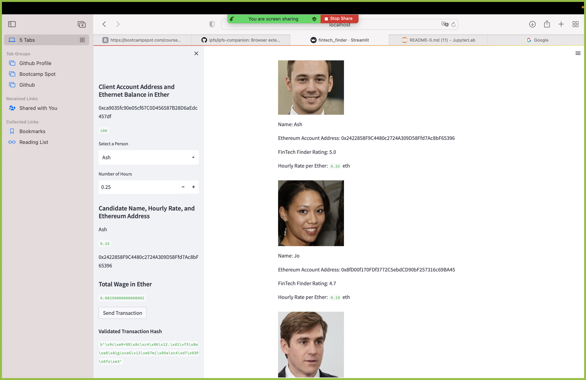
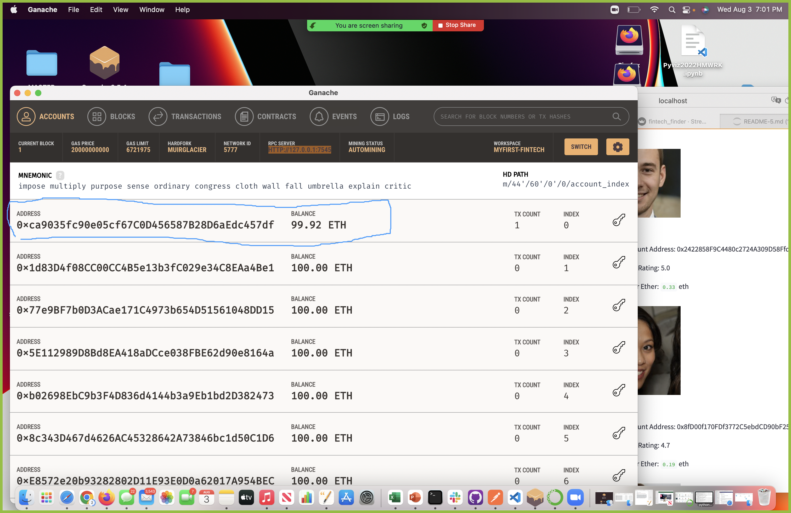

Unit20 - Blockchain wallet

After updating .py files, to complete code per instructions.  Ran and tested Streamlit.  Completed a transaction using Streamlit via Gnache, confirmed payment for services rendered was completed, and corresponding debit shown afterwards within Gnache account.
